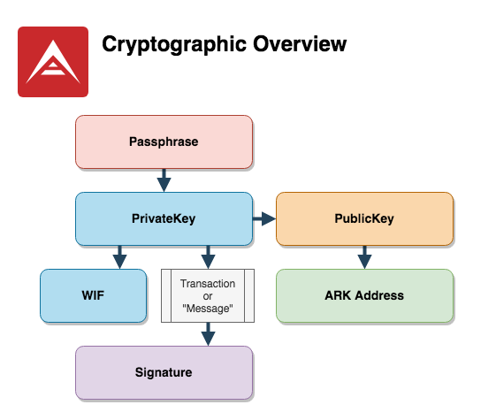
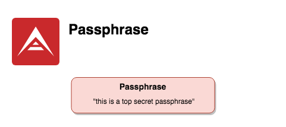
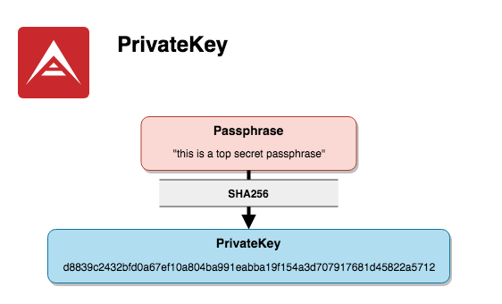
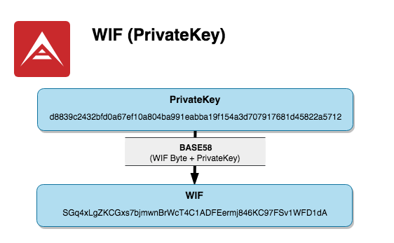
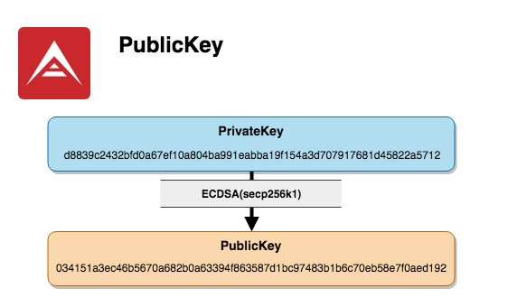
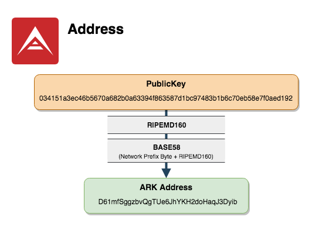
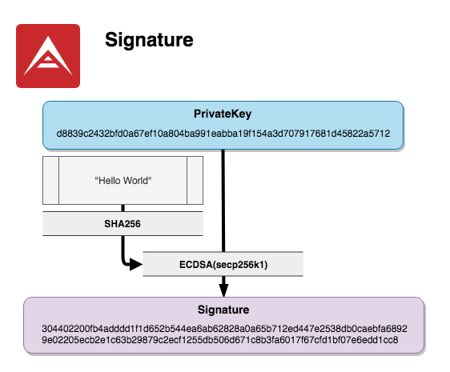
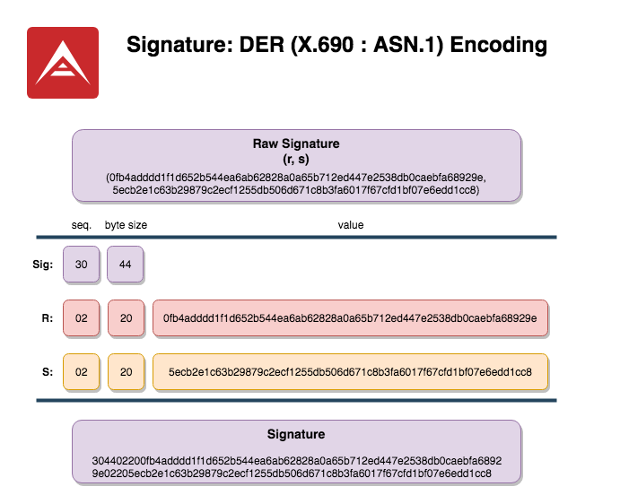

# Cryptography

This section provides a brief overview the cryptographic identities and protocols used by the [ARK blockchain](/introduction/blockchain/).

[[toc]]

The following examples will be using test-fixtures from the [ARK Core](https://github.com/ARKEcosystem/core/) repo on [GitHub](https://github.com/ARKEcosystem/).

[Identities Test Fixtures:](https://github.com/ARKEcosystem/core/blob/develop/__tests__/unit/crypto/identities/fixture.json)

```json
{
  "data": {
    "privateKey": "d8839c2432bfd0a67ef10a804ba991eabba19f154a3d707917681d45822a5712",
    "publicKey": "034151a3ec46b5670a682b0a63394f863587d1bc97483b1b6c70eb58e7f0aed192",
    "address": "D61mfSggzbvQgTUe6JhYKH2doHaqJ3Dyib",
    "wif": "SGq4xLgZKCGxs7bjmwnBrWcT4C1ADFEermj846KC97FSv1WFD1dA"
  },
  "passphrase": "this is a top secret passphrase"
}
```

[Message Test Fixtures:](https://github.com/ARKEcosystem/core/blob/develop/__tests__/unit/crypto/utils/message.test.ts)

```ts
const fixture = {
  data: {
    publicKey:
      "034151a3ec46b5670a682b0a63394f863587d1bc97483b1b6c70eb58e7f0aed192",
    signature:
      "304402200fb4adddd1f1d652b544ea6ab62828a0a65b712ed447e2538db0caebfa68929e02205ecb2e1c63b29879c2ecf1255db506d671c8b3fa6017f67cfd1bf07e6edd1cc8",
    message: "Hello World"
  },
  passphrase: "this is a top secret passphrase"
};
```

## Overview



## Passphrase



> The passphrase is the master password (key) for your ARK tokens. Every ARK address has its own unique passphrase. With the passphrase you can sign transactions to send your ARK or vote for a delegate.
>
> Do not lose it, and do not share it with others, or you could lose access to your ARK tokens. If you lose your passphrase, or if it is stolen, there is nothing we can do to help you. We CANNOT recover any lost passphrases.

A [passphrase](/faq/passphrases.html) is a "key to the castle." It is used to directly calculate the [PrivateKey](#privatekey) of an [ARK account](/glossary/#account) and should never be shared, stored irresponsibly, or transmitted over the internet. The only person that should ever have access to a passphrase is the owner of its account.

We can technically use any word, phrase, or string as a passphrase which will result in a valid ARK [Address](#address) or Wallet; however, it is heavily discouraged as the security of an address relies on the randomness of its Passphrase.
Humans are bad at creating randomness, and entering sequences of random letters and numbers isn't easy to do accurately.

To promote usability while also maintaining security, ARK passphrases are implemented using the [BIP39 Protocol](https://github.com/bitcoin/bips/blob/master/bip-0039.mediawiki). Simply, it's a mnemonic sentence constructed via randomly chosen words from a large [wordlist](https://github.com/bitcoin/bips/blob/master/bip-0039/bip-0039-wordlists.md). From here, that sentence or "Passphrase" is piped through a series of hashing, curve, and encoding algorithms to derive a [PrivateKey](#privatekey) / [WIF](#wif), a [PublicKey](#publickey), and subsequently [Addresses](#address) / Wallets and [Signatures](#signature).

> To learn more about randomness, visit the Wiki's on [Randomness](https://en.wikipedia.org/wiki/Randomness) and [Random Number Generation](https://en.wikipedia.org/wiki/Random_number_generation)

## PrivateKey



A PrivateKey is a 256-bit integer represented by a 32-byte Hex-encoded string of 64 characters obtained via [SHA256 hashing](https://en.bitcoinwiki.org/wiki/SHA-256) of a [Passphrase](#passphrase).

To understand the significance of this large number, consider the following:

Passphrase:

```asciidoc
"this is a top secret passphrase"
```

PrivateKey HEX (base 16) / SHA256 of Passphrase:

```asciidoc
d8839c2432bfd0a67ef10a804ba991eabba19f154a3d707917681d45822a5712
```

PrivateKey DEC(base 10 encoded):

```asciidoc
97932109907804210295451942024598204992707895659209392543371974078748689061650
```

The DEC representation is the "base 10" interpretation of our PrivateKey and gives us a little insight into the size of the numbers we're dealing with "under the hood". This large integer is also referred to as a "BigNumber" or UINT256.

## WIF (PrivateKey)



WIF stands for "Wallet Import Format", and is a [BASE58](#base58check)-encoded PrivateKey prepended by a network prefix-byte (`0xaa` for ARK Mainnet & Devnet).

It's essentially a more useable/human-readable [PrivateKey](#privatekey) and should be treated with the same diligence with regards to storage and security.

## PublicKey



A PublicKey is like an ID or Passport. It is a mathematical proof of identity and is derived from a [PrivateKey](#privatekey) via [ECDSA](#ecdsa) and [SECP256K1](#secp256k1) computation.

ARK also uses "Point Compression" to obtain compressed PublicKeys that are 33-bytes in length.

## Address / Wallet



An ARK address is shareable much like an e-mail address. It is the destination to which ARK tokens can be sent, and is obtained from a [PublicKey](#publickey) via a combination of [RIPEMD160](#ripemd160) hashing and [Base58Check](#base58check) encoding prefixed by a single network byte.

Since an address is derived from a [PublicKey](#publickey), that means it is also mathematically tied to a [PrivateKey](#privatekey) and [Passphrase](#passphrase).

### Network Prefixes

| Network | dec |  hex   | Prefix  | Example address                      |
| :------ | :-: | :----: | :-----: | :----------------------------------- |
| Mainnet | 23  | `0x17` |   `A`   | `AewxfHQobSc49a4radHp74JZCGP8LRe4xA` |
| Devnet  | 30  | `0x1E` |   `D`   | `D61mfSggzbvQgTUe6JhYKH2doHaqJ3Dyib` |

#### Address Prefix Table

The following is a full prefix-byte table for custom Address construction and is provided for informational purposes.
While this would not be used for ARK Mainnet or Devnet, it _CAN_ be used for custom networks.

|      dec      |      hex        |       Prefix        |
| :-----------: | :-------------: | :-----------------: |
|      `0`      |     `0x00`      |         `1`         |
|      `1`      |     `0x01`      | `Q-Z`, `a-k`, `m-o` |
|      `2`      |     `0x02`      |    `o-z`, or `2`    |
|      `3`      |     `0x03`      |         `2`         |
|      `4`      |     `0x04`      |     `2` or `3`      |
|   `5` - `6`   | `0x05` - `0x06` |         `3`         |
|      `7`      |     `0x07`      |     `3` or `4`      |
|      `8`      |     `0x08`      |         `4`         |
|      `9`      |     `0x09`      |     `4` or `5`      |
|  `10` - `11`  | `0x0A` - `0x0B` |         `5`         |
|     `12`      |     `0x0C`      |     `5` or `6`      |
|     `13`      |     `0x0D`      |         `6`         |
|     `14`      |      `0xE`      |     `6` or `7`      |
|  `15` - `16`  | `0x0F` - `0x10` |         `7`         |
|     `17`      |     `0x11`      |     `7` or `8`      |
|     `18`      |     `0x12`      |         `8`         |
|     `19`      |     `0x13`      |     `8` or `9`      |
|  `20` -`21`   | `0x14` - `0x15` |         `9`         |
|     `22`      |     `0x16`      |     `9` or `A`      |
|     `23`      |     `0x17`      |         `A`         |
|     `24`      |     `0x18`      |     `A` or `B`      |
|  `25` - `26`  | `0x19` - `0x1A` |         `B`         |
|     `27`      |     `0x1B`      |     `B` or `C`      |
|     `28`      |     `0x1C`      |         `C`         |
|     `29`      |     `0x1D`      |     `C` or `D`      |
|  `30` - `31`  | `0x1E` - `0x1F` |         `D`         |
|     `32`      |     `0x20`      |     `D` or `E`      |
|     `33`      |     `0x21`      |         `E`         |
|     `34`      |     `0x22`      |     `E` or `F"`     |
|  `35` - `36`  | `0x23` - `0x24` |         `F`         |
|     `37`      |     `0x25`      |     `F` or `G`      |
|     `38`      |     `0x26`      |         `G`         |
|     `39`      |     `0x27`      |     `G` or `H`      |
|  `40` - `41`  | `0x28` - `0x29` |         `H`         |
|     `42`      |     `0x2A`      |     `H` or `J`      |
|     `43`      |     `0x2B`      |         `J`         |
|     `44`      |     `0x2C`      |     `J` or `K`      |
|  `45` - `46`  | `0x2D` - `0x2E` |         `K`         |
|     `47`      |     `0x2F`      |     `K` or `L`      |
|     `48`      |     `0x30`      |         `L`         |
|     `49`      |     `0x31`      |     `L` or `M`      |
|  `50` - `51`  | `0x32` - `0x33` |         `M`         |
|     `52`      |     `0x34`      |     `M` or `N`      |
|     `53`      |     `0x35`      |         `N`         |
|     `54`      |     `0x36`      |     `N` or `P`      |
|  `55` - `56`  | `0x37` - `0x38` |         `P`         |
|     `57`      |     `0x39`      |     `P` or `Q`      |
|     `58`      |     `0x3A`      |         `Q`         |
|     `59`      |     `0x3B`      |     `Q` or `R`      |
|  `60` - `61`  | `0x3C` - `0x3D` |         `R`         |
|     `62`      |     `0x3E`      |     `R` or `S`      |
|     `63`      |     `0x3F`      |         `S`         |
|     `64`      |     `0x40`      |     `S` or `T`      |
|  `65` - `66`  | `0x41` - `0x42` |         `T`         |
|     `67`      |     `0x43`      |     `T` or `U`      |
|     `68`      |     `0x44`      |         `U`         |
|     `69`      |     `0x45`      |     `U` or `V`      |
|  `70` - `71`  | `0x46` - `0x47` |         `V`         |
|     `72`      |     `0x48`      |     `V` or `W`      |
|     `73`      |     `0x49`      |         `W`         |
|     `74`      |     `0x4A`      |     `W` or `X`      |
|  `75` - `76`  | `0x4B` - `0x4C` |         `X`         |
|     `77`      |     `0x4D`      |     `X` or `Y`      |
|     `78`      |     `0x4E`      |         `Y`         |
|     `79`      |     `0x4F`      |     `Y` or `Z`      |
|  `80` - `81`  | `0x50` - `0x51` |         `Z`         |
|     `82`      |     `0x52`      |      `Z` or`a`      |
|     `83`      |     `0x53`      |         `a`         |
|     `84`      |     `0x54`      |     `a` or `b`      |
|     `85`      |     `0x55`      |         `b`         |
|     `86`      |     `0x56`      |     `b` or `c`      |
|  `87` - `88`  | `0x57` - `0x58` |         `c`         |
|     `89`      |     `0x59`      |     `c` or `d`      |
|     `90`      |     `0x5A`      |         `d`         |
|     `91`      |     `0x5B`      |     `d` or `e`      |
|  `92` - `93`  | `0x5C` - `0x5D` |         `e`         |
|     `94`      |     `0x5E`      |     `e` or `f`      |
|     `95`      |     `0x5F`      |         `f`         |
|     `96`      |     `0x60`      |     `f` or `g`      |
|  `97` - `98`  | `0x61` - `0x62` |         `g`         |
|     `99`      |     `0x63`      |     `g` or `h`      |
|     `100`     |     `0x64`      |         `h`         |
|     `101`     |     `0x65`      |     `h` or `i`      |
| `102` - `103` | `0x66` - `0x67` |         `i`         |
|     `104`     |     `0x68`      |     `i` or `j`      |
|     `105`     |     `0x69`      |         `j`         |
|     `106`     |     `0x6A`      |     `j` or `k`      |
| `107` - `108` | `0x6B` - `0x6C` |         `k`         |
|     `109`     |     `0x6D`      |     `k` or `m`      |
|     `110`     |     `0x6E`      |         `m`         |
|     `111`     |     `0x6F`      |     `m` or `n`      |
| `112` - `113` | `0x70` - `0x71` |         `n`         |
|     `114`     |     `0x72`      |     `n` or `o`      |
|     `115`     |     `0x73`      |         `o`         |
|     `116`     |     `0x74`      |     `o` or `p`      |
| `117` - `118` | `0x75` - `0x76` |         `p`         |
|     `119`     |     `0x77`      |     `p` or `q`      |
|     `120`     |     `0x78`      |         `q`         |
|     `121`     |     `0x79`      |     `q` or `r`      |
| `122` - `123` |     `0x7A`      |         `r`         |
|     `124`     |     `0x7B`      |     `r` or `s`      |
|     `125`     |     `0x7C`      |         `s`         |
|     `126`     |     `0x7D`      |     `s` or `t`      |
| `127` - `128` | `0x7F` - `0x80` |         `t`         |
|     `129`     |     `0x81`      |     `t` or `u`      |
|     `130`     |     `0x82`      |         `u`         |
|     `131`     |     `0x83`      |     `u` or `v`      |
| `132` - `133` | `0x84` - `0x85` |         `v`         |
|     `134`     |     `0x86`      |     `v` or `w`      |
|     `135`     |     `0x87`      |         `w`         |
|     `136`     |     `0x88`      |     `w` or `x`      |
| `137` - `138` | `0x89` - `0x8A` |         `x`         |
|     `139`     |     `0x8B`      |     `x` or `y`      |
|     `140`     |     `0x8C`      |         `y`         |
|     `141`     |     `0x8D`      |     `y` or `z`      |
| `142` - `143` | `0x8E` - `0x8F` |         `z`         |
|     `144`     |     `0x90`      |     `z` or `2`      |
| `145` - `255` | `0x91` - `0xFF` |         `2`         |

> Adapted from: [https://en.bitcoin.it/wiki/List_of_address_prefixes](https://en.bitcoin.it/wiki/List_of_address_prefixes)

<!-- ### BIP32 | HD Wallets -->

## Signature



A Signature is essentially proof that a message or transaction was "signed" by a particular [PrivateKey](#privatekey) / [Passphrase](#passphrase).

Remember that this same [PrivateKey](#privatekey) also has a matching [PublicKey](#publickey).
That means a Signature is computationally linked to its corresponding PublicKey using [ECDSA](#ecdsa) and [SECP256K1](#secp256k1) standards.

ARK Signatures also use [DER Encoding](#der).

## Algorithms and Encoding

### Cryptographic

#### ECDSA

[ECDSA](https://en.bitcoinwiki.org/wiki/Elliptic_Curve_Digital_Signature_Algorithm) is a ["Digital Signature Algorithm"](https://en.wikipedia.org/wiki/Digital_Signature_Algorithm) variant based on and ["Modular Arithmetic"](https://en.wikipedia.org/wiki/Modular_arithmetic).

It is a standard to sign and verify transactions/messages and [Signatures](#signature) using [Elliptical Curve Cryptography](https://en.wikipedia.org/wiki/Elliptic-curve_cryptography).

|            ECDSA Equation              |
| :------------------------------------: |
| y<sup>2</sup> = x<sup>3</sup> + ax + b |

---

##### SECP256K1

[SECP256K1](https://en.bitcoinwiki.org/wiki/Secp256k1) defines the set of [ECDSA](#ecdsa) parameters used to produce output "deterministically", meaning the same input will always result in the same output.
Additionally, no two inputs will ever produce the same output;
It is also hard to reverse.
This is known as the [Discrete Logarithm Problem](https://en.wikipedia.org/wiki/Discrete_logarithm#Cryptography) and is the basis for Curve Cryptography.

| Curve Parameters |
| :--------------: |
|       a = 0      |
|       b = 7      |

|             SECP256K1 Equation             |
| :----------------------------------------: |
| y<sup>2</sup> = x<sup>3</sup> + (0)x + (7) |
|     y<sup>2</sup> = x<sup>3</sup> + 7      |

> Can the reader say what two numbers multiplied together will produce the number 8616460799? I think it unlikely that anyone but myself will ever know.
>
> ~ William S Jevons, The Principles of Science, 1874

### Encoding

#### DER



An ARK Signature is [DER Encoded](https://en.wikipedia.org/wiki/X.690#DER_encoding) using [BIP66](https://github.com/bitcoin/bips/blob/master/bip-0066.mediawiki) standards.

Upon obtaining a Signature from the ECDSA/SECP256K1 algorithm, it will first be in its raw form known as an "r" and "s" value.

Signature (r, s):

```asciidoc
(0fb4adddd1f1d652b544ea6ab62828a0a65b712ed447e2538db0caebfa68929e, 5ecb2e1c63b29879c2ecf1255db506d671c8b3fa6017f67cfd1bf07e6edd1cc8)
```

In our example, the "r" and "s" values are each 32-bytes in length.
Each of the "r" and "s" sequence identifiers are also 1-byte in length.
Additionally, the slots for the size of "r" and "s" each occupy 1-byte.

This means that the length of the "r" and "s" values is 64-bytes.
The (r,s) section identifiers and their sizes occupy a total of 4-bytes.

The total length of our signature is 68-bytes (`0x44` in hex).

| Identifier   | Size (dec) | Size (hex) |
| :----------- | :--------: | :--------: |
| r sequence   |    `1`     |    `0x1`   |
| r size       |    `1`     |    `0x1`   |
| r-value:     |   `32`     |   `0x20`   |
| s sequence   |    `1`     |    `0x1`   |
| s size       |    `1`     |    `0x1`   |
| s-value      |   `32`     |   `0x20`   |
| total length |   `68`     |   `0x44`   |

The very first byte of an encoded signature is the sequence identifier `30`.

To encode the (r, s) values, we place `30` as the leading byte, followed by the total signature length (`0x44` in this example).

We then place the sequence identifier for "r" (`02`), proceeded by the size of "r" in hex (`0x20`), proceeded by the r-value itself (`0fb4adddd1f1d652b544ea6ab62828a0a65b712ed447e2538db0caebfa68929e`).

Finally, we place the sequence identifier for "s" (`02`), proceeded by the size of "s" in hex (`0x20`), proceeded by the s-value itself (`5ecb2e1c63b29879c2ecf1255db506d671c8b3fa6017f67cfd1bf07e6edd1cc8`).

DER Encoded Signature:

```asciidoc
304402200fb4adddd1f1d652b544ea6ab62828a0a65b712ed447e2538db0caebfa68929e02205ecb2e1c63b29879c2ecf1255db506d671c8b3fa6017f67cfd1bf07e6edd1cc8
```

---

#### BASE58check

[Base58Check](https://en.bitcoin.it/wiki/Base58Check_encoding) encoding is used to produce human readable/typeable text from a hash.

It is used to encode a [PrivateKey](#privatekey) and is also the final step to encoding an [ARK address](#address).

---

### Hashing

#### RIPEMD160

[RIPEMD160](https://en.bitcoin.it/wiki/RIPEMD-160) is a subset of the [RIPEMD](https://en.wikipedia.org/wiki/RIPEMD) family of [cryptographic hash functions](https://en.wikipedia.org/wiki/Cryptographic_hash_function).

As its name suggests, RIPEMD160 hashes are 160-bits in length.

---

#### SHA256

SHA256 is a subset of the [SHA-2](https://en.wikipedia.org/wiki/SHA-2) family of [cryptographic hash functions](https://en.wikipedia.org/wiki/Cryptographic_hash_function).

As its name suggests, SHA256 hashes are 256-bits in length.

<!--
NOTE:
Images provided in this doc are located in the `/cryptography/assets` directory.
These were created--and may be edited--using the free web-app https://draw.io.
-->
