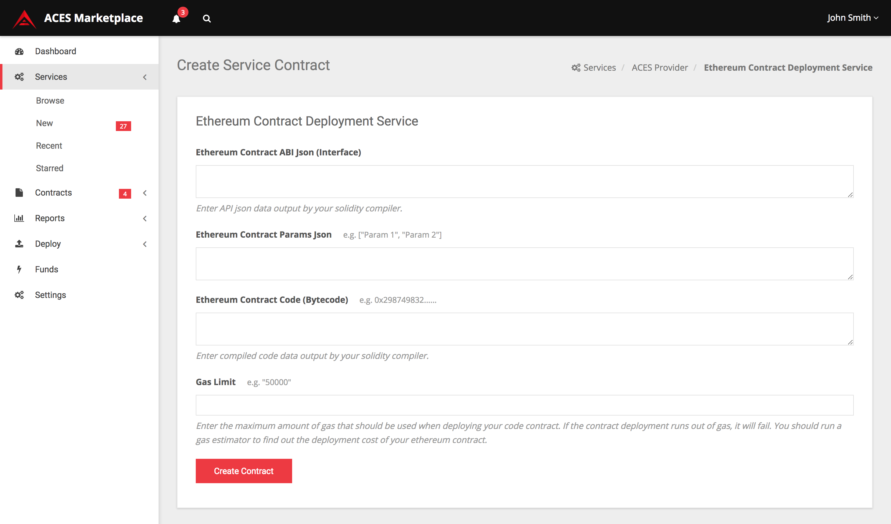

# How Does ARK SmartBridge Work?

[[toc]]

By now many people want to know the technical details of ARK’s SmartBridge but broken down into a less technical and everyday example. That’s what this article will focus This article will also assume the case that most blockchains are already SmartBridge compatible.

SmartBridge is the ability to connect and communicate between blockchains. By connecting blockchains, we can solve the great question of the last few years in the altcoin community. Which coin will replace bitcoin? The answer is none of them, and all of them.

With ARK’s SmartBridge Technology every coin becomes even more powerful, every app produced on any blockchain has the potential to reach a greater audience, and even bitcoin can gain the functionality of every altcoin through a simple blockchain token called ARK.

One way ARK will facilitate a less strict form of state channels is through the SmartBridge data field and dedicated encoded listeners, multi-chain full nodes offering services such as cross-chain transfers and contract executions. Time-locks ensure that malicious encoded listeners are unable to profit, much like Bitcoin's [lightening network](https://en.wikipedia.org/wiki/Lightning_Network).

### What does that mean?

It’s quite simple. If you want to trigger an event on a blockchain via a different blockchain, you check if that chain is SmartBridge compatible (sufficient reputable encoded listeners offering services). If it is, then you can issue a SmartBridge transaction to any compatible blockchain via the ark wallet and the possibilities are endless.

**Example 1:** If you wanted to trigger an ETH smart contract but hold ARK, you could send the instructions through ark SmartBridge, right in the wallet to trigger the event. The code embedded in the ETH chain is always listening for an ark SmartBridge transaction and will collect this info and trigger the function to issue a contract.

**Example 2:** You want to issue a record entry in Factom, but you only hold ARK. So you would go to your ARK wallet, enter the correct info and instructions for the FCT chain via the SmartBridge tab. Then send it. That’s it, now the FCT chain receives the info and acts appropriately.

**Example 3:** I want to send 10 ARK to my ETH wallet. This would require an encoded listener with a back-end ability to exchange currencies. (i.e., Shapeshift, Changelly, or Coinbase) Once I send my 10 ARK to my ETH wallet, the encoded listener sees this TX (transaction) as an exchange function and acts accordingly. The encoded listener automatically picks up that this TX needs a conversion, so it serves as a relay node picking up the TX, converting it, and rebroadcasting the TX on its way to the ETH wallet. The encoded listener collects a small fee for processing the TX.

(Example 3 would require Shapeshift to be its encoded listener so that it is always looking for the next SmartBridge TX. Just like ARK, Encoded listener nodes set their transaction fees. Which can be adjusted by the node operator but not ARK.)

### Encoded listeners

The Encoded listener node is a hub for listening to SmartBridge transactions. This transaction hub can be set up and run by anyone, Shapeshift, Changelly or even Coinbase. Anyone that wants to act as a medium to help the network can. So in exchange for providing this service, they will be collecting transaction fees for passing data or exchanging currencies via SmartBridge.
