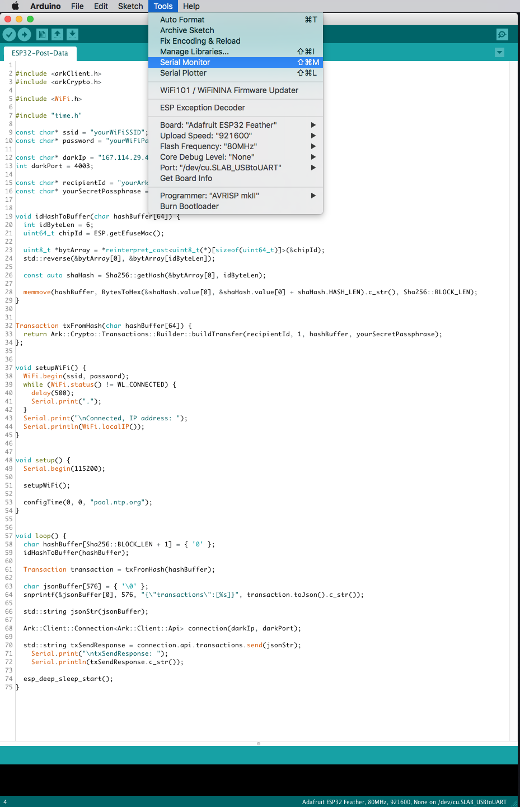
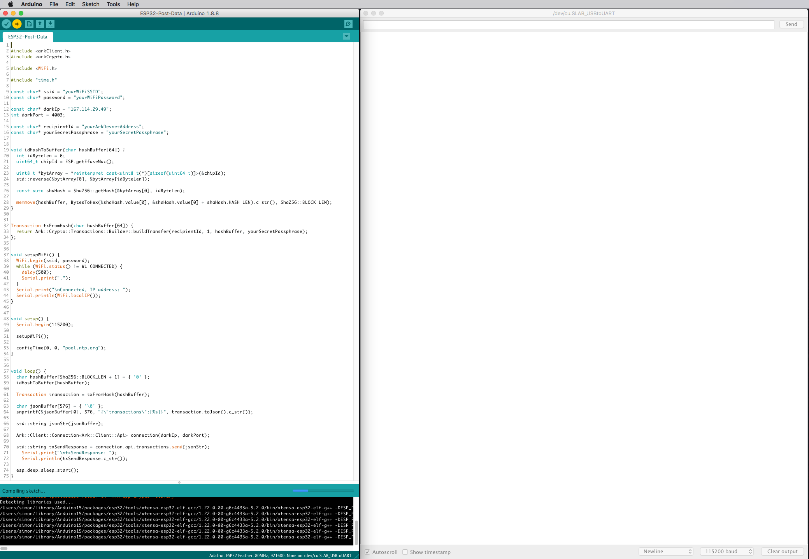
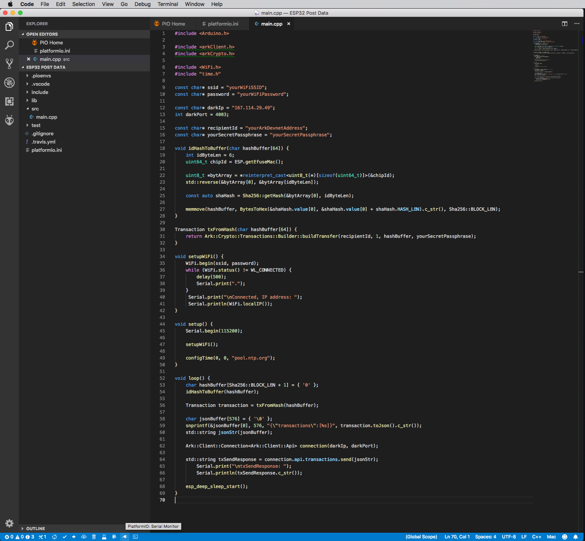
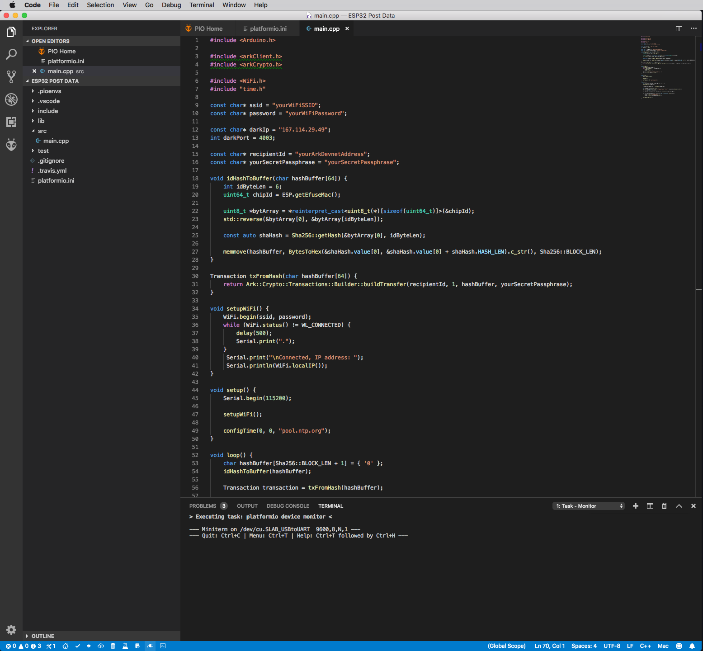
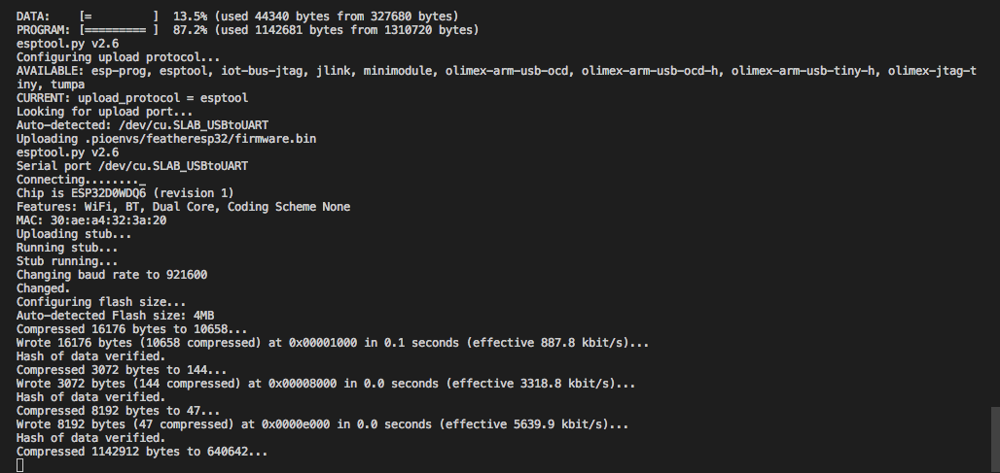
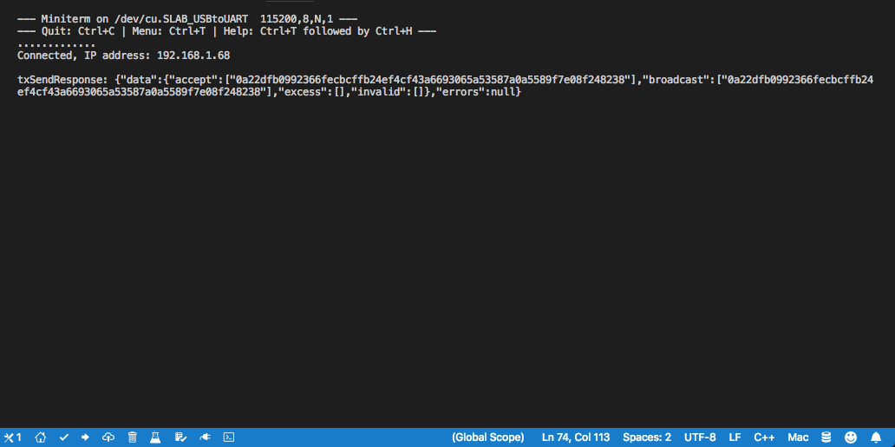

# Storing Data on the Blockchain

The ability to store data on a public Blockchain brings many benefits.
You can store, prove, verify, or reference data in a way that suits your use case.

[[toc]]

The example sketch we will be building works on both, the [Arduino IDE](/tutorials/iot/environment/arduino) and with [PlatformIO](/tutorials/iot/environment/os).
We will be using ARK Cpp-Client, Cpp-Crypto, and an Adafruit ESP32 Feather to post a SHA256 hash of your boards 'Chip ID' to the [ARK Blockchain](/introduction/blockchain).

## Step 1: Project Setup

If you're using PlatformIO, your `platformio.ini` file should look like this:

```
; PlatformIO Project Configuration File
;
;   Build options: build flags, source filter
;   Upload options: custom upload port, speed and extra flags
;   Library options: dependencies, extra library storages
;   Advanced options: extra scripting
;
; Please visit documentation for the other options and examples
; https://docs.platformio.org/page/projectconf.html

[env:featheresp32]
platform = espressif32
board = featheresp32
framework = arduino
lib_deps = ARK-Cpp-Client, ARK-Cpp-Crypto
upload_speed = 921600
monitor_speed = 115200
```

> if you're using arduino, you can skip this `platformio.ini` part above ^.

---

Open a new sketch using the [Arduino IDE](/tutorials/iot/environment/arduino), or your 'main.cpp' file if using PlatformIO.
Start by adding the headers to import Arduino, ARK Cpp-Client, and Cpp-Crypto.

```cpp
#include <Arduino.h>

#include <arkClient.h>
#include <arkCrypto.h>

void setup() {
    // put your setup code here, to run once:
}

void loop() {
    // put your main code here, to run repeatedly:
}
```

The ESP32 uses the 'WiFi.h' and 'HTTPClient.h' headers to setup your WiFi connection.

```cpp
#include <WiFi.h>
#include <HTTPClient.h>
```

We also are using Cpp-Crypto's Transaction signing, and need a way to set the time, so we'll also include 'time.h'.

```cpp
#include "time.h"
```

Next, add your WiFi network and password.

```cpp
const char* ssid = "yourWiFiSSID";
const char* password = "yourWiFiPassword";
```

We will also need a Devnet Peer to connect to.
> You can find more ARK Peers here: [https://github.com/ARKEcosystem/peers](https://github.com/ARKEcosystem/peers)

```cpp
const char* darkIp = "167.114.29.49";
int darkPort = 4003;
```

Now, we'll add your ARK Devnet [(DARK) Address](/glossary/#dark-address) and your [Passphrase](/faq/passphrases.html#passphrases).
Make sure to delete this Passphrase from your sketch when we're finished.

```cpp
const char* recipientId = "yourARKDevnetAddress";
const char* yourSecretPassphrase = "yourSecretPassphrase";
```

Let's also configure the 'setup()' method to initialize your boards serial connection.

```cpp
 void setup() {
    // put your setup code here, to run once:
    Serial.begin(115200);
}
```

Next, we'll add a method to setup and connect to your WiFi, and call that method from setup.

```cpp
void setupWiFi() {
    WiFi.begin(ssid, password);
    while (WiFi.status() != WL_CONNECTED) {
        delay(500);
        Serial.print(".");
    }
    Serial.print("\nConnected, IP address: ");
    Serial.println(WiFi.localIP());
}

void setup() {
    // put your setup code here, to run once:
    Serial.begin(115200);

    setupWiFi();
}
```

Finally, we'll add the call to configure your boards time.

```cpp
configTime(0, 0, "pool.ntp.org");
```

Your sketch should now look something like this:

```cpp
#include <Arduino.h>

#include <arkClient.h>
#include <arkCrypto.h>

#include <WiFi.h>

#include "time.h"

const char* ssid = "yourSDID";
const char* password = "yourPassword";

const char* darkIp = "167.114.29.49";
int darkPort = 4003;

const char* recipientId = "yourARKDevnetAddress";
const char* yourSecretPassphrase = "yourSecretPassphrase";

void setupWiFi() {
    WiFi.begin(ssid, password);
    while (WiFi.status() != WL_CONNECTED) {
        delay(500);
        Serial.print(".");
    }
    Serial.println();
    Serial.print("Connected, IP address: ");
    Serial.println(WiFi.localIP());
}

void setup() {
    // put your setup code here, to run once:
    Serial.begin(115200);

    setupWiFi();

    configTime(0, 0, "pool.ntp.org");
}

void loop() {
    // put your main code here, to run repeatedly:
}
```

## Step 2: Create a SHA256 hash of your ESP32s Chip ID

The data we will be posting is a SHA256 hash of your boards Chip ID.
Let's start by creating a method for doing this.

```cpp
void idHashToBuffer(char hashBuffer[64]) {
};
```

Next add variables for the ID's byte-length and uint64_t Chip ID .
This is basically just the boards MAC address.

```cpp
void idHashToBuffer(char hashBuffer[64]) {
    int idByteLen = 6;
    uint64_t chipId = ESP.getEfuseMac();
};
```

The Chip ID is a 64-bit unsigned(positive) DEC encoded value.
To properly perform a SHA256 hash, we'll need the uint8_t/byte value.
The ESP32 also used "little-endian" or "least significant byte",
basically, we need to reverse this byte-array.

```cpp
uint8_t *bytArray = *reinterpret_cast<uint8_t(*)[sizeof(uint64_t)]>(&chipId);
std::reverse(&bytArray[0], &bytArray[idByteLen]);
```

Now let's make the SHA256 hash.

```cpp
const auto shaHash = Sha256::getHash(&bytArray[0], idByteLen);
```

Finally, we move the hash to the hashBuffer we passed into this new method.

```cpp
memmove(hashBuffer, BytesToHex(&shaHash.value[0], &shaHash.value[0] + shaHash.HASH_LEN).c_str(), Sha256::BLOCK_LEN);
```

When this method is done, is should look like the following:

```cpp
void idHashToBuffer(char hashBuffer[64]) {
    int idByteLen = 6;
    uint64_t chipId = ESP.getEfuseMac();

    uint8_t *bytArray = *reinterpret_cast<uint8_t(*)[sizeof(uint64_t)]>(&chipId);
    std::reverse(&bytArray[0], &bytArray[idByteLen]);

    const auto shaHash = Sha256::getHash(&bytArray[0], idByteLen);
    memmove(hashBuffer, BytesToHex(&shaHash.value[0], &shaHash.value[0] + shaHash.HASH_LEN).c_str(), Sha256::BLOCK_LEN);
};
```

## Step 3: Build the Transaction

Here, we will build the transaction using your ARK Devnet [(DARK) Address](/glossary/#dark-address), 0.00000001 DARK, your boards 'Chip ID' SHA256 hash, and your [Secret Passphrase](/faq/passphrases.html#passphrases).

Lets create another method to handle this.

```cpp
Transaction txFromHash(char hashBuffer[64]) {
};
```

'return' the line to build the transaction.

```cpp
return ARK::Crypto::Transactions::Builder::buildTransfer(recipientId, 1, hashBuffer, yourSecretPassphrase);
```

It should look like this when you're finished:

```cpp
Transaction txFromHash(char hashBuffer[64]) {
   return ARK::Crypto::Transactions::Builder::buildTransfer(recipientId, 1, hashBuffer, yourSecretPassphrase);
};
```

## Step 4: Tying it all together!

Now that we have our methods setup, we'll continue with filling in the 'loop()' section of this sketch.

Inside the 'loop()' method, create a buffer for your boards Chip ID hash, and pass that buffer to the 'idHashToBuffer()' method we made earlier.

```cpp
char hashBuffer[Sha256::BLOCK_LEN + 1] = { '0' };idHashToBuffer(hashBuffer);
```

Next, lets create the Transaction by passing our Chip ID hash to our 'txFromHash()' method.

```cpp
Transaction transaction = txFromHash(hashBuffer);
```

Now that the Transaction has been built, let's get the Transactions' JSON and "snprintf' that into a Transactions JSON array buffer.
We'll then copy that buffer into a std::string for passing to the ARK-Client API.

```cpp
char jsonBuffer[576] = { '\0' };
snprintf(&jsonBuffer[0], 576, "{\"transactions\":[%s]}", transaction.toJson().c_str());
std::string jsonStr(jsonBuffer);
```

This is where we will use ARK Cpp-Client to create an API connection using the 'darkIp' and 'darkPort' we declared earlier.

```cpp
ARK::Client::Connection<ARK::Client::Api> connection(darkIp, darkPort);
```

Next we send the transactions array to the ARK Network!

```cpp
std::string txSendResponse = connection.api.transactions.send(jsonStr);
    Serial.print("\ntxSendResponse: ");
    Serial.println(txSendResponse.c_str());
```

We don't want to keep running this task, so we'll wrap all this up by putting the board to sleep.

```cpp
esp_deep_sleep_start();
```

When we're done, the 'loop()' section should look like this.

```cpp
void loop() {
    char hashBuffer[Sha256::BLOCK_LEN + 1] = { '0' };
    idHashToBuffer(hashBuffer);

    Transaction transaction = txFromHash(hashBuffer);

    char jsonBuffer[576] = { '\0' };
    snprintf(&jsonBuffer[0], 576, "{\"transactions\":[%s]}", transaction.toJson().c_str());
    std::string jsonStr(jsonBuffer);

    ARK::Client::Connection<ARK::Client::Api> connection(darkIp, darkPort);

    std::string txSendResponse = connection.api.transactions.send(jsonStr);
        Serial.print("\ntxSendResponse: ");
        Serial.println(txSendResponse.c_str());

    esp_deep_sleep_start();
}
```

The final sketch should look something like this

```cpp
#include <Arduino.h>

#include <arkClient.h>
#include <arkCrypto.h>

#include <WiFi.h>

#include "time.h"

const char* ssid = "yourWiFiSSID";
const char* password = "yourWiFiPassword";

const char* darkIp = "167.114.29.49";
int darkPort = 4003;

const char* recipientId = "yourARKDevnetAddress";
const char* yourSecretPassphrase = "yourSecretPassphrase";

void idHashToBuffer(char hashBuffer[64]) {
    int idByteLen = 6;
    uint64_t chipId = ESP.getEfuseMac();

    uint8_t *bytArray = *reinterpret_cast<uint8_t(*)[sizeof(uint64_t)]>(&chipId);
    std::reverse(&bytArray[0], &bytArray[idByteLen]);

    const auto shaHash = Sha256::getHash(&bytArray[0], idByteLen);

    memmove(hashBuffer, BytesToHex(&shaHash.value[0], &shaHash.value[0] + shaHash.HASH_LEN).c_str(), Sha256::BLOCK_LEN);
}

Transaction txFromHash(char hashBuffer[64]) {
    return ARK::Crypto::Transactions::Builder::buildTransfer(recipientId, 1, hashBuffer, yourSecretPassphrase);
}

void setupWiFi() {
    WiFi.begin(ssid, password);
    while (WiFi.status() != WL_CONNECTED) {
        delay(500);
        Serial.print(".");
    }
     Serial.print("\nConnected, IP address: ");
     Serial.println(WiFi.localIP());
}

void setup() {
    Serial.begin(115200);

    setupWiFi();

    configTime(0, 0, "pool.ntp.org");
}

void loop() {
    char hashBuffer[Sha256::BLOCK_LEN + 1] = { '0' };
    idHashToBuffer(hashBuffer);

    Transaction transaction = txFromHash(hashBuffer);

    char jsonBuffer[576] = { '\0' };
    snprintf(&jsonBuffer[0], 576, "{\"transactions\":[%s]}", transaction.toJson().c_str());
    std::string jsonStr(jsonBuffer);

    ARK::Client::Connection<ARK::Client::Api> connection(darkIp, darkPort);

    std::string txSendResponse = connection.api.transactions.send(jsonStr);
        Serial.print("\ntxSendResponse: ");
        Serial.println(txSendResponse.c_str());

    esp_deep_sleep_start();
}
```

## Step 5: Running Your Example!

### Arduino

Plug your ESP32 into your computer via USB, and open the serial monitor.



Press the arrow at the top left to upload the sketch to your board.



You can see the compiler doing its thing in that window to the bottom left. This is also where any errors or warning would show up.


After the sketch is flashed to your board, you should get a response in the serial monitor.
This is what a successfully POSTed Transaction response will look like.


### PlatformIO

Plug your ESP32 into your computer via USB, and open the serial monitor.



Press the arrow towards the bottom left to upload the sketch to your board.
You can see the compiler doing its thing in that window to the bottom right. This is also where any errors or warning would show up.





After the sketch is flashed to your board, you should get a response in the serial monitor!

This is what a successfully POSTed Transaction response will look like:



---

Congrats, you just used IoT and the ARK Ecosystem to store sensor data on a public Blockchain! 🎉 🎊

Keep in mind, we don't have to always "stick to the script."
Now that we have a basic understanding of how to post data to the blockchain,
we can get creative and store or reference nearly any type of information we please.
We could serialize or encode information, we could reference an IPFS hash, or simply send a friendly message with our transaction.

The [VendorField](/glossary/#smartbridge) is a very simple but powerful [concept](https://docs.ark.io/introduction/ark/how-does-ark-smartbridge-work.html).
