# How to Use the Desktop Wallet

[[toc]]

## What is it?

The ARK Desktop Wallet is an application which allows you to manage ARK transactions. It provides an extensive set of functionalities, including management of profiles and wallets, the creation of both online and offline transactions, wallet summary, stylistic customizations, multilingual support, various currency integrations including BTC and much more!

## Installation

To download the application, you can visit the link below and select the appropriate release for your computer's platform. The ARK Desktop Wallet is available for Windows, Mac, and Linux.

[ARK Desktop Wallet releases](https://github.com/ARKEcosystem/ark-desktop/releases)

::: warning
**Note**: The above link is the authoritative source for ARK Desktop Wallet releases. As a friendly reminder, don't ever click on links that are not provided by the ARK Team.
:::

When you arrive on this page, you will see multiple download options. Select the one that reflects your operating system:

## Getting Started

After opening the ARK Desktop Wallet application for the first time, you will be greeted with security instructions. Please read every slide, as each one provides essential details on how you can better protect your funds.

Once you've read through the welcome instructions, you will be presented a page on which you can create your first profile. This is a multiple-stepped process in which you enter or select:

- **Profile details**
  - Your chosen profile name
  - The application's language and currency settings
  - Which language to use for [12-word BIP39 Passphrase](https://en.bitcoin.it/wiki/Seed_phrase)
  - One of many amazing avatars

- **Network**
  - Which network to operate on, either the regular ARK network or the ARK Devnet (for developers)

- **Appearance**
  - The Light or Dark theme
  - Your favorite background design

Upon successfully creating your profile, you will be brought to the dashboard.

## News and Important Updates

The Desktop Wallet has a dedicated section, showing news and other relevant updates in the ARK Ecosystem. Often, you will receive new blog posts in this section, which can be accessed via clicking the newspaper icon in the wallet's navigation bar.

## Creating or Importing your ARK Wallet

The ARK Desktop Wallet allows you to both create new wallets and import existing ones. You can begin either process by clicking the appropriate button at the top of the sidebar when on the app dashboard.

### Creating a New Wallet

- **Pick an address to claim**
  

- **Save your 12-word BIP39 Passphrase**
  

- **Prove that you have saved your Passphrase**
  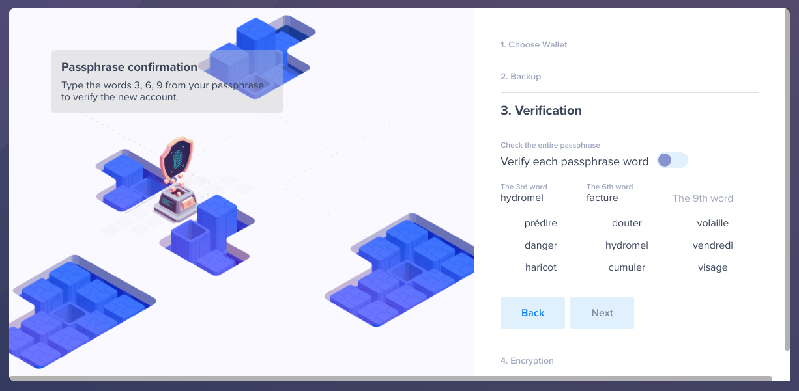

- _(Optional)_ **Require a password to decrypt the Passphrase for an added layer of security**
  

- _(Optional)_ **Name the new wallet and copy its address**
  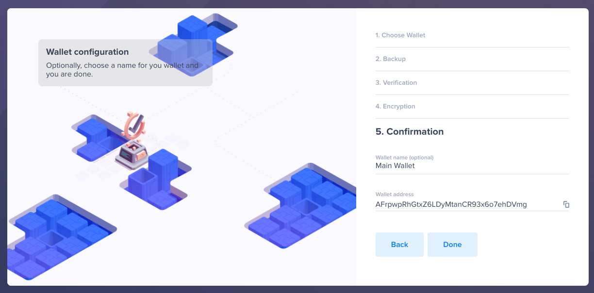

### Importing your Wallet

- **Import your wallet by providing its address, passphrase, or both**
  

- _(Optional)_ **Require a password to decrypt the Passphrase for an added layer of security**
  

- _(Optional)_ **Name the new wallet and copy its address**
  

## Wallet Interface

The wallet interface page can be reached by clicking on the wallet icon in the navigation bar of the application. On it, you will be able to view your profile or an individual wallet's balance. Some shortcuts are also provided to create or import a wallet and see the details of one of your wallet.

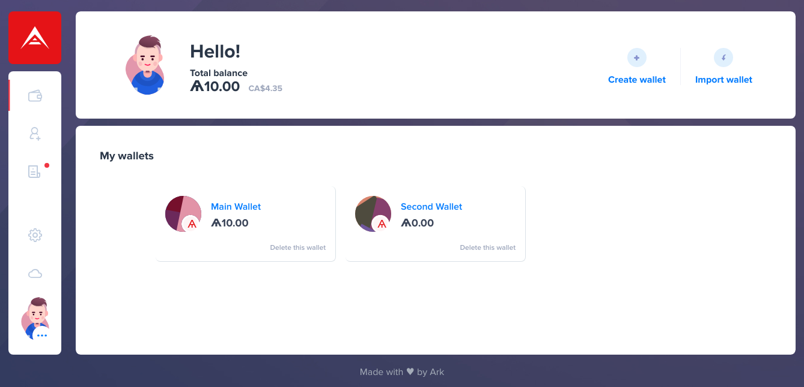

### Wallet details

On the wallet detail page, which is accessed by clicking on the wallet's name or icon from the wallet interface, you can:

- Transfer ARK.
- View and sort the wallet's transactions.
- Vote for a registered delegate.
- Sign and verify messages cryptographically.
- Purchase ARK through [Changelly](https://changelly.com).
- Register a second passphrase for added security.
- Register the wallet as a delegate.

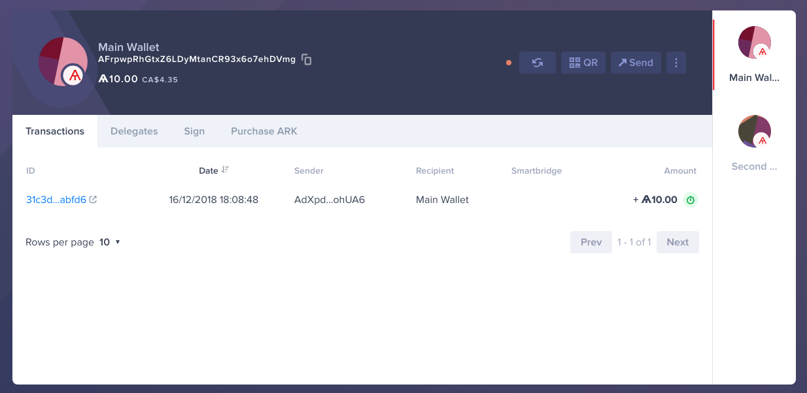

### Sending an ARK transfer

Transferring ARK from your wallet is the most common type of transaction.

You can quickly send a transfer by clicking on the **_Send_** button in the header of the wallet detail page. This will bring up a prompt, on which you can fill in the required information to create a transfer transaction.

Upon clicking **_Next_**, you will have to review the transfer transaction's details and decide whether to submit it, then discard or save it by clicking **_Send_**, **_Back_** or **_Save_**.

### Voting for a Registered Delegate and Unvoting

Delegated Proof of Stake, the consensus algorithm used by the ARK Core, requires network participants to vote for delegates with their funds. A vote is not like a transfer; it merely helps determine which delegates have the most support from network members. You may only vote for one delegate at a time, and your funds are not locked while you are voting.

- **Browse the list of registered delegates**
  

- **Choose the delegate you wish to vote for, review their statistics and click _Vote_**
  

- **Fill in the required vote transaction fields and click _Next_**
  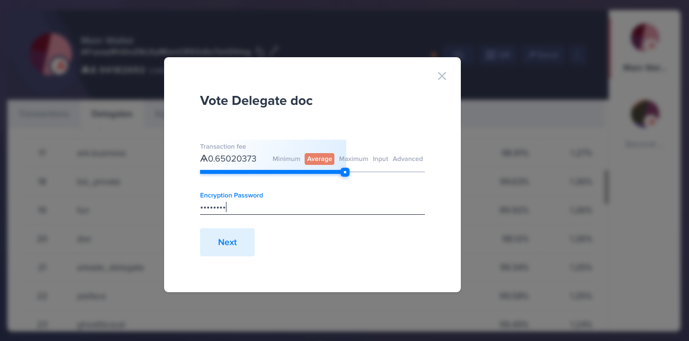

- **Submit, discard or save the vote transaction by pressing either _Send_, _Back_ or _Save_**
  

**_Unvoting_**

- **Open the list of registered delegates**
  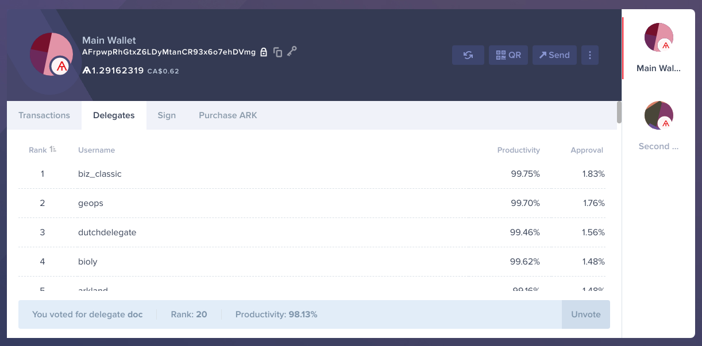

- **Click on the _Unvote_ button**
  

- **Review the delegate's stats and click the _Unvote_ button**
  

- **Choose a transcation fee, enter your security details and click _Next_**
  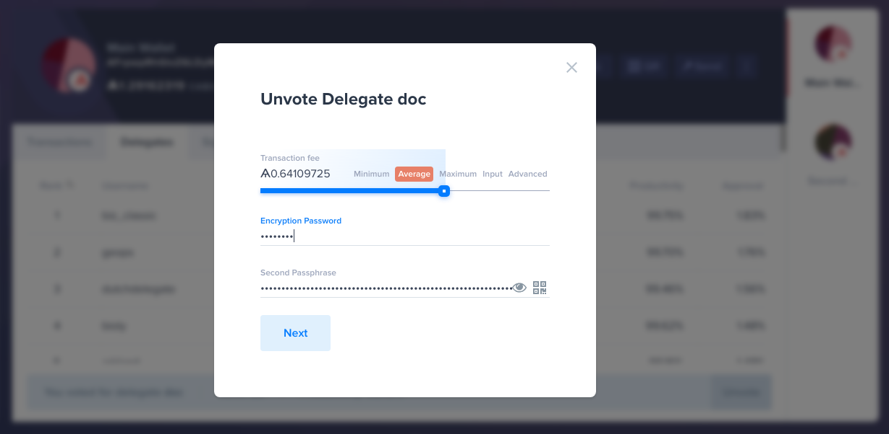

- **Submit the unvote transaction and Submit, Cancel or Save it by clicking either _Send_, _Back_ or _Save_**
  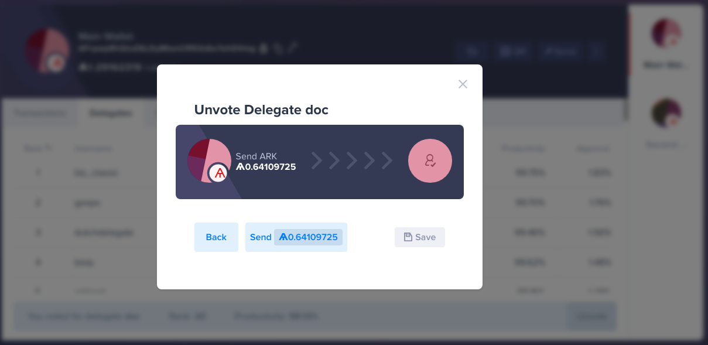

### Signing and Verifying Messages

The wallet allows you to create and sign a message that other users will be able to verify as authentically yours.

Message signing and verifying is all done under the **Sign** tab of the wallet detail page.

#### Signing a Message

With a signed message, others can verify that a given message and signature combination originate from you.

- **Input your security details and the message to sign, then click _Sign_**
  

- **Your signed message will appear under the Sign tab of the wallet detail page**
  

#### Verifying a Message

To verify a message that was signed by a different wallet, you need the wallet's public key, the original message, and the resulting signature.

:::tip
The public key of a wallet is much like the address, except it doesn't follow the same format and is not shown by default in the Desktop Wallet. You can view your wallet's public key by clicking the key icon next to your wallet's address in the wallet detail page's header.

The ARK network will only know your public key once you have sent a transaction.
:::

For demonstration purposes, the images below are shown from the perspective of a second wallet, assuming the necessary details to verify the message were provided to the verifying user.

- **Enter the message to verify, the public key of the wallet which was used to sign the message and the resulting signature, then click _Next_**
  

- **See whether the message was successfully verified or not**
  

### Register as a Delegate

Registering as a delegate is a simple transaction. It provides network nodes with a record of the sending address opening itself to accept votes from other wallets. You can only vote for an address that was registered in this fashion.

- **Expose more options in the wallet detail page by clicking the icon in the header**
  

- **Click the _Register delegate_ button**
  

- **Enter your desired Username, Transaction fee and security details; then click _Next_**
  

- **Verify the delegate registration transaction details and Submit, Cancel or Save it by clicking either _Send_, _Back_ or _Save_**
  

### Register a Second Passphrase

Security is critical. By issuing a second signature transaction, you tell network nodes to verify that every transaction coming from your wallet is also signed by another Passphrase.

- **Show more options in the wallet detail page by clicking the icon in the header**
  

- **Click the _Second passphrase_ button**
  

- **Save your 12-word BIP39 second Passphrase and click _Next_**
  

- **Prove that you have saved your second Passphrase, select your desired transaction fee, enter your security details and click _Next_**
  

- **Verify the second signature transaction details and Submit, Cancel or Save it by clicking either _Send_, _Back_ or _Save_**
  

## Contact Interface

The application provides you a neat interface to add addresses to your contact list. This feature enables you to aggregate all of the addresses which you may transact with or be interested in.

### Adding a Contact

You can access the contact creation menu by first clicking on the contact icon in the wallet's navigation bar which will expose your contact list.

- **Enter the contact's address and click _Next_**
  

- _(Optional)_ **Enter a name for the contact and click \*Done**
  

- **You can now view that contact's activity**
  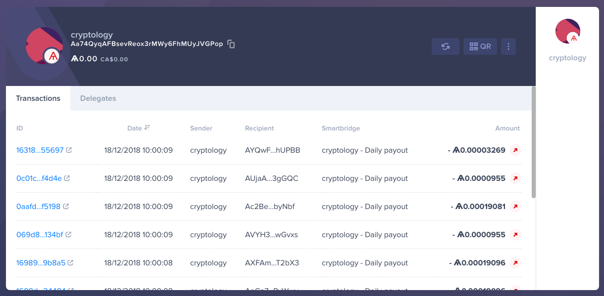

- **And have access to the contact's activity through the contact interface**
  

## Changing the Application's Settings

There's a bunch of options for how you may customize the look, behaviour, and feel of the application.

### Network Options

Network settings can be modified by clicking on the cloud icon in the navigation bar; bringing up a side menu. In the Network settings menu, you may select another peer to use for fetching transaction and wallet updates. Also, the menu offers some valuable information about the network and advanced configuration options in the **Network Overview** section.

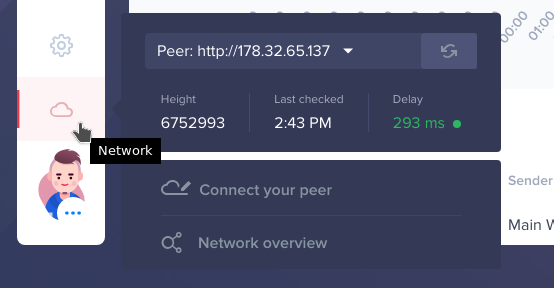

### Appearance Options

There are two locations where you can change style and behavior settings.

#### Changing Display Settings

In the first menu, which you access by clicking the settings icon of the navigation bar, you can:

- Change the default currency.
- Toggle dark mode.
- Toggle ledger hardware wallet background syncing.
- Toggle the display of the price chart on the dashboard.
- Reset the wallet's data.

::: warning
Resetting the wallet's data should almost never be done. It will permanently delete all of your profiles, wallets, contacts, addresses and all other data associated with the application.
:::

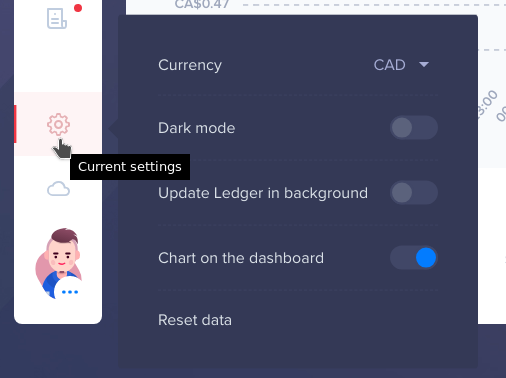

#### Changing Profile Settings

The choices you made when creating your profile can be changed by a menu that is accessible by clicking on your profile icon in the navigation bar.

From this menu, you can create a new profile or edit your existing profile(s).

There are a few profile settings you can affect in this way, namely:

- The profile's name.
- The language for this profile.
- The language for the 12 BIP39 passphrase words.
- The default currency for this profile.
- Which avatar to use for this profile.

## Security

If you discover a security vulnerability within this project, please send an e-mail to <security@ark.io>. All security vulnerabilities will be promptly addressed.
